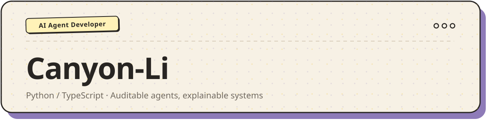
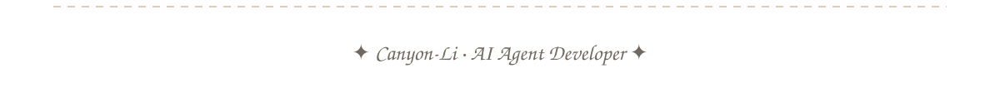

## 👨‍💻 About Me

- 🤖 专注 **AI Agent / RAG / MCP** 方向的开发与探索
- 🦅 主力项目 **[Peregrine](https://github.com/Canyon-Li/peregrine)** — Python 后端 + React 前端 + Swift 原生的桌面端 AI Agent 应用
- 🦀 同时在折腾 **[AuditronClaw](https://github.com/Canyon-Li/AuditronClaw)**
- 📚 正在精读 letta / llama_index / ragflow 等开源项目源码
- 🛠️ 偶尔写点自动化小工具

## 📊 GitHub Stats

| Stats | Streak |
| :---: | :---: |
|  |  |

## 🛠️ Tech Stack

## 🐍 Watch the snake eat my contributions

<picture>
  <source media="(prefers-color-scheme: dark)" srcset="https://raw.githubusercontent.com/Canyon-Li/Canyon-Li/output/github-contribution-grid-snake-dark.svg" />
  <source media="(prefers-color-scheme: light)" srcset="https://raw.githubusercontent.com/Canyon-Li/Canyon-Li/output/github-contribution-grid-snake.svg" />
  
</picture>

 

